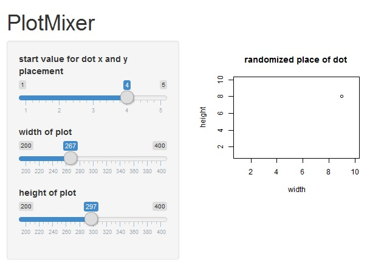

Plotmixer presentation
========================================================
author: Jarmo Pesonen
date: 24.8.2016
autosize: true

I am studying R and analytics, because of interest of working in this area. This is small app, which changes look of generated plot. 

ui.R and server.R R codes can be found from GitHub, direct link to R source code repository 

https://github.com/Jarmo79/plotmixer

Plotmixer description
========================================================

This R Shiny app offers possibilities to change size of generated plot and also modify plot contents 

There are three slide bars in web page screen
- location of dot drawn to plot area
- dynamically width of generated plot 
- dynamically height of generated plot

Numbering of x y axis are fixed

Plotmixer controllers
========================================================

Slide bar definitions
- location of dot changes place of dot between 1 to 10 
- width of plot changes plot width
- height of plot changs plot height

Example of generated layout and functionality
========================================================

You can give start value for dot (same value for x and y axis) and app
randomizes placement of dot by adding random number to x and y value between 1 to 5. It is also 
possible to change plot dimensions. Any change in three different slidebars causes recalculation for
placed dot.

So, let's learn and start drawing some more plots!
========================================================

  

Couple of example of packages with more intense drawing capabilities
========================================================

Interactive plots can be drawn using GGobi package!

http://www.statmethods.net/advgraphs/interactive.html

Packages like hexbin, scatterplot3D and Rcmdr provide possibilities to draw higher density scatterplots and 3D pesentations!

http://www.statmethods.net/graphs/scatterplot.html

